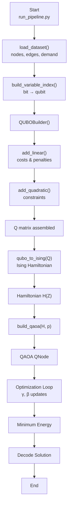

# HasQir|a>
## Q_MOD

## Overview

HasQir|a> is an **all-in-one optimization framework** designed to unify classical, quantum-inspired, and quantum-native optimization techniques within a single, extensible pipeline. The framework is particularly motivated by **energy systems optimization**, but its abstractions are general enough to support a wide range of combinatorial and continuous optimization problems.

At its core, HasQir|a> bridges:

* Problem formulation (data → variables → constraints)
* Mathematical encoding (QUBO / Ising / hybrid models)
* Optimization backends (classical solvers, variational quantum algorithms)
* Result interpretation (solutions mapped back to real-world systems)

The goal is not only to *solve* optimization problems, but to provide a **transparent, research-grade workflow** that allows experimentation, comparison, and gradual migration from classical to quantum methods.

---


---

## Intended Framework Architecture

The second figure illustrates the **intended HasQir|a> framework architecture**.

Conceptually, the framework is structured into the following layers:

### 1. Data Layer

* Domain-specific datasets (nodes, edges, loads, costs, constraints)
* Abstracted input independent of solver choice

### 2. Encoding Layer

* Variable indexing and symbolic representations
* QUBO construction
* Ising Hamiltonian generation
* Constraint penalties and balancing terms

### 3. Optimization Layer

* Classical optimizers
* Quantum-inspired solvers
* Variational Quantum Algorithms (e.g., QAOA)
* Hardware-agnostic execution (simulation first, hardware later)

### 4. Interpretation Layer

* Statevector or bitstring extraction
* Mapping solutions back to physical variables
* Cost, feasibility, and performance analysis

This layered design ensures **modularity**, **reproducibility**, and **scalability**.

---

## Design Philosophy

HasQir|a> is built around the following principles:

* **Solver-agnostic problem definitions**
  Problems are defined once and reused across multiple backends.

* **Explicit mathematical representations**
  QUBO and Ising models are first-class objects, not hidden artifacts.

* **Research transparency**
  Every step (encoding, optimization, decoding) is inspectable and debuggable.

* **Quantum-ready, not quantum-dependent**
  The framework works today with simulators and classical solvers, while remaining future-proof for hardware execution.

---


## Vision

HasQir|a> is building an all-in-one Quantum Optimization Software and aims to evolve into a reference framework for applied quantum optimization, enabling real-world problems to be studied rigorously, transparently, and incrementally — without hype, but with scientific discipline.

---


### Figure 2: Quantum Dispatch Framework Architecture


This figure presents the intended end-to-end architecture of the quantum dispatch and optimization framework, highlighting data ingestion, modeling layers (QUBO / Ising), solver backends, and result interpretation.

---

## Code Flow

### AQC — Quantum Optimization Pipeline

#### Execution Flow



---

## How to Run

From the project root:

```bash
cd Q_MOD
python -m pipeline.run_pipeline
```

This ensures all internal modules (`data`, `qubo`, `hamiltonian`, `qaoa`) are resolved correctly via Python’s module system. Next we must choose a dataset.

---

## Documentation

The framework is organized as a modular quantum optimization stack:

* **Data Layer**: Synthetic or real-world datasets describing nodes, edges, loads, costs, and renewables.
* **Encoding Layer**: Binary decision variables mapped to qubits via indexed dictionaries.
* **Optimization Layer**: Construction of QUBO cost functions and constraint penalties.
* **Quantum Layer**: Conversion to an Ising Hamiltonian and execution via QAOA.
* **Post‑Processing**: Classical decoding of the lowest‑energy bitstring into actionable decisions.

---

## Requirements

* Python ≥ 3.10
* Anaconda or virtualenv (recommended)
* Git

---

## Dependencies

Create a `requirements.txt` file with:

```txt
scipy
pennylane
autograd
networkx
matplotlib
```

Install using:

```bash
pip install -r requirements.txt
```

---

## Frontend Pipeline (Planned)

The frontend layer will provide:

* Interactive problem configuration (nodes, costs, constraints)
* Visualization of QUBO graphs and Ising Hamiltonians
* Real‑time tracking of QAOA convergence
* Decoded solution dashboards (generation, renewables, flows)

Target implementations include:

* Web UI (React + Python backend)
* Jupyter‑based exploratory interface
* API‑driven integration with external energy and logistics systems

---
## Still Under Active Development

HasQir|a> is an evolving platform. Several core capability areas are actively being designed and implemented to support the long-term vision of an all-in-one quantum optimization software.

### 1. Quantum Machine Learning (QML) Modules

Planned QML components include:

- Variational quantum models for classification and regression
- Hybrid quantum–classical learning pipelines
- Quantum feature maps integrated with classical preprocessing
- Reusable QML blocks interoperable with optimization workflows

These modules will enable learning-driven optimization, model adaptation, and data-informed quantum decision-making.

### 2. Machine Learning (ML) Modules

Classical ML modules will complement quantum components by providing:

- Demand forecasting and scenario generation
- Surrogate models for expensive quantum evaluations
- Constraint learning and parameter tuning
- Benchmarking baselines for hybrid and quantum methods

ML modules will integrate seamlessly with optimization pipelines to support hybrid intelligence rather than isolated solvers.

### 3. Quantum Error Correction (QEC) Modules

Future QEC-focused work will address hardware realism and robustness, including:

- Noise-aware circuit execution
- Error mitigation techniques for variational algorithms
- Abstractions for fault-tolerant execution when hardware allows
- Comparative studies of algorithm performance under noise

QEC modules will ensure that HasQir|a> remains relevant as quantum hardware matures from NISQ to fault-tolerant regimes.


